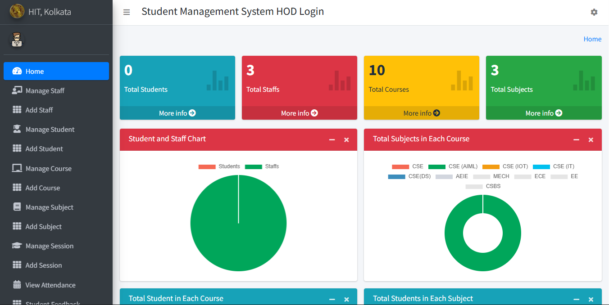

# Django Student Attendance System

This is a Student Attendance System Developed for Educational Purpose using Python (Django).

And if you like this project then ADD a STAR ⭐️ to this project 👆

## System Preview



## Features of this Project

### A. Admin Users Can

1. See Overall Summary Charts of Stuudents Performance, Staffs Perfomrances, Courses, Subjects, Leave, etc.
2. Manage Staffs (Add, Update and Delete)
3. Manage Students (Add, Update and Delete)
4. Manage Course (Add, Update and Delete)
5. Manage Subjects (Add, Update and Delete)
6. Manage Sessions (Add, Update and Delete)
7. View Student Attendance
8. Review and Reply Student/Staff Feedback
9. Review (Approve/Reject) Student/Staff Leave

### B. Staff/Teachers Can

1. See the Overall Summary Charts related to their students, their subjects, leave status, etc.
2. Take/Update Students Attendance
3. Add/Update Result
4. Apply for Leave
5. Send Feedback to HOD

### C. Students Can

1. See the Overall Summary Charts related to their attendance, their subjects, leave status, etc.
2. View Attendance
3. View Result
4. Apply for Leave
5. Send Feedback to HOD

## 🚀 Quick Deployment Options

### ⚡ Automated Setup (Recommended)

**For Local Development:**
```bash
chmod +x setup-local.sh
./setup-local.sh
```

**For Heroku Deployment:**
```bash
chmod +x deploy-heroku.sh
./deploy-heroku.sh
```

**For Docker Deployment:**
```bash
chmod +x deploy-docker.sh
./deploy-docker.sh
```

📋 **For detailed deployment instructions, see [DEPLOYMENT.md](DEPLOYMENT.md)**

## How to Install and Run this project?

### Pre-Requisites:

1. Install Git Version Control
   [ https://git-scm.com/ ]

2. Install Python Latest Version (3.9+)
   [ https://www.python.org/downloads/ ]

3. Install Pip (Package Manager)
   [ https://pip.pypa.io/en/stable/installing/ ]

_Alternative to Pip is Homebrew_

### Installation

**1. Create a Folder where you want to save the project**

**2. Create a Virtual Environment and Activate**

Install Virtual Environment First

```
$  pip install virtualenv
```

Create Virtual Environment

For Windows

```
$  python -m venv venv
```

For Mac

```
$  python3 -m venv venv
```

Activate Virtual Environment

For Windows

```
$  venv\scripts\activate
```

For Mac

```
$  venv\bin\activate
```

**3. Clone this project**

```
$  git clone (gitlink)
```

Then, Enter the project

```
$  cd django-student-attendance-system
```

**4. Install Requirements from 'requirements.txt'**

```python
$  pip install -r requirements.txt
```

**5. Add the hosts**

- Got to settings.py file
- Then, On allowed hosts, Add [‘*’].

```python
ALLOWED_HOSTS = ['*']
```

_No need to change on Mac._

**6. Now Run Server**

Command for PC:

```python
$ python manage.py runserver
```

Command for Mac:

```python
$ python3 manage.py runserver
```

**7. Login Credentials**

Create Super User (HOD)

```
$  python manage.py createsuperuser
```

Then Add Email, Username and Password

**or Use Default Credentials**

_For HOD /SuperAdmin_
Email: admin@gmail.com
Password: admin

_For Staff_
Email: staff@gmail.com
Password: staff

_For Student_
Email: student@gmail.com
Password: student

## 🔧 Environment Variables

The project uses environment variables for configuration. Copy `.env.example` to `.env` and update with your values:

```env
# Django Configuration
SECRET_KEY=your-secret-key-here
DEBUG=False
ALLOWED_HOSTS=yourdomain.com,www.yourdomain.com,localhost

# Database Configuration
DB_ENGINE=django.db.backends.postgresql
DB_NAME=college_management_db
DB_USER=your_db_user
DB_PASSWORD=your_db_password
DB_HOST=localhost
DB_PORT=5432

# Security Settings (Production)
SECURE_SSL_REDIRECT=True
SESSION_COOKIE_SECURE=True
CSRF_COOKIE_SECURE=True
```

See `.env.example` for all available configuration options.

## 🐳 Docker Deployment

Quick deployment using Docker:

```bash
# Build and run with Docker Compose
docker-compose up -d

# Run migrations
docker-compose exec web python manage.py migrate

# Create superuser
docker-compose exec web python manage.py createsuperuser
```

## ☁️ Cloud Deployment

### Heroku
```bash
# Create app and deploy
heroku create your-app-name
heroku addons:create heroku-postgresql:hobby-dev
heroku config:set SECRET_KEY="your-secret-key"
heroku config:set DEBUG=False
git push heroku main
heroku run python manage.py migrate
```

### Production Security

⚠️ **Important for Production:**
- Set `DEBUG=False`
- Use PostgreSQL instead of SQLite
- Configure proper `ALLOWED_HOSTS`
- Enable HTTPS/SSL
- Set secure cookie flags
- Use environment variables for secrets

## Copyrights

Coded by @pawan_kumar , @ankit_raj, @prince_sen_gupta, @mahima_vasisth

Developed for Design Thinking and idea lab, heritage inititute of technology, kolkata

Copyright 2024 @pawan_kumar

Permission is hereby granted, free of charge, to any person obtaining a copy of this software and associated documentation files (the "Software"), to deal in the Software without restriction, including without limitation the rights to use, copy, modify, merge, publish, distribute, sublicense, and/or sell copies of the Software, and to permit persons to whom the Software is furnished to do so, subject to the following conditions:

The above copyright notice and this permission notice shall be included in all copies or substantial portions of the Software.

THE SOFTWARE IS PROVIDED "AS IS", WITHOUT WARRANTY OF ANY KIND, EXPRESS OR IMPLIED, INCLUDING BUT NOT LIMITED TO THE WARRANTIES OF MERCHANTABILITY, FITNESS FOR A PARTICULAR PURPOSE AND NONINFRINGEMENT. IN NO EVENT SHALL THE AUTHORS OR COPYRIGHT HOLDERS BE LIABLE FOR ANY CLAIM, DAMAGES OR OTHER LIABILITY, WHETHER IN AN ACTION OF CONTRACT, TORT OR OTHERWISE, ARISING FROM, OUT OF OR IN CONNECTION WITH THE SOFTWARE OR THE USE OR OTHER DEALINGS IN THE SOFTWARE.
